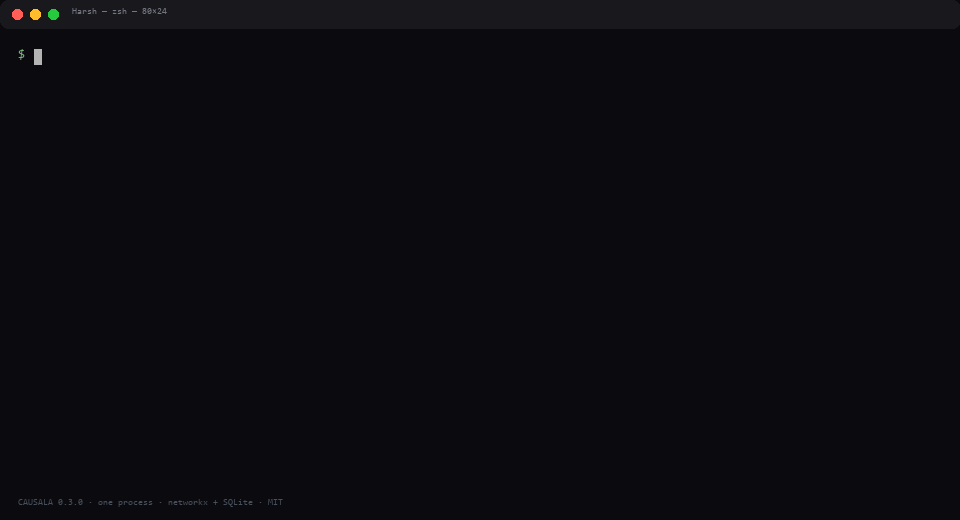
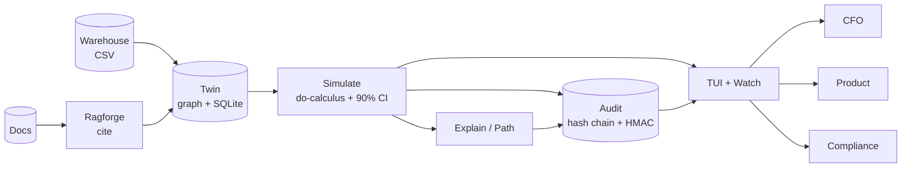

<p align="center">
  
</p>

<h1 align="center">CAUSALA - What will this lever actually cause?</h1>

<p align="center">
  <strong>The decision twin that proves your next move will cause X with a point, a 90% band, and a signed receipt.</strong><br/>
  Your board asks before you spend. CAUSALA answers.
</p>

<p align="center">

[](https://github.com/harshaaaaw/Causala)
[](LICENSE)
[](https://github.com/harshaaaaw/Causala/actions)
[](causala/pyproject.toml)
[](https://github.com/harshaaaaw/Causala/releases)

</p>

<p align="center">

[Quickstart](#quickstart) · [Python API](causala/README.md) · [Architecture](#architecture) · [Roadmap](ROADMAP.md) · [Security](SECURITY.md)

</p>

<p align="center">
  
  <br/>
  <em>Warehouse CSV when you have it. No warehouse to try.</em>
</p>

```
$ causala simulate --lever price --delta 3 --tenant acme

  demand:  2.46%  [1.985, 2.935]  audit cd98f5cc  conf 0.82
    cite: finance-q3-review  path: price -> demand
    honest: thin data (n=4) -> wide CI width 0.95
  margin:  1.75%  [1.174, 2.332]  audit 03ef0410  conf 0.58
    cite: finance-q3-review  path: price -> demand -> margin
    honest: thin data (n=4) -> wide CI width 1.16
```

That is the product. You move a lever. The twin walks your causal graph. Every outcome has a band. Every run has a receipt you can hand to finance or a regulator.

---

## Why this twin exists

Most teams have three things that never agree. A warehouse that shows what happened. An LLM that guesses why. A spreadsheet that invents ROI. None can answer what happens if we do X with a number you can defend. So marketing builds one model, finance builds another, ops builds a third, and the board gets a point with no band and no source.

BCG said it plainly in 2026. Three quarters of leaders rank AI top three, one in four sees returns, six in ten set no KPI. Forrester found 88 percent of pilots never ship. I think the gap is not better models. It is the receipt.

## Who it is for

| Who | What they do with it |
|---|---|
| **CFO** | Price a headcount or price change from a signed ledger, not a story |
| **Product** | Test a lever before code, see the path that explains why |
| **Ops** | Trace cost_up back to cache_miss with citations |
| **Compliance** | Replay why the model said X three quarters later |

## How it works

Four moves. No cluster.

1. **Graph your causes.** `causala ingest --cause price --effect demand --conf 0.82 --source finance-q3-review` or `causala ingest-csv --file examples/warehouse.csv`. The key is `tenant + cause + effect + source`, so the same claim never duplicates. You can retract it.

2. **Honesty before math.** If data is thin, the 90 percent band widens. If the path is contested, it widens. You see the band before the point, so you never get false precision.

3. **Simulate the lever.** `causala simulate --lever price --delta 3` runs do-calculus over the graph you ingested. Every downstream outcome returns `point + [ci_low, ci_high] + audit_id`.

4. **Hand the receipt.** Every outcome writes a hash-chained record with `prev_hash` and HMAC-SHA256 per tenant. `causala audit --id cd98f5cc` or `causala verify-chain` proves the chain.

## Quickstart

<a id="quickstart"></a>

```bash
git clone https://github.com/harshaaaaw/Causala.git && cd Causala
pip install -e ./causala -e ./ragforge
causala quickstart                 # ingests examples/warehouse.csv and simulates price +3%
# -> demand: 2.46% [1.985, 2.935] audit cd98f5cc
# -> margin: 1.75% [1.174, 2.332] audit 03ef0410

# your own graph
causala ingest --cause price --effect demand --conf 0.82 --source finance-q3-review --tenant acme
causala ingest-csv --file examples/warehouse.csv --tenant acme
causala simulate --lever price --delta 3 --tenant acme
causala tui                         # live cockpit
```

Python, same twin:

```python
from causa import Causala

twin = Causala("twin.db")
twin.ingest_claim("price", "demand", 0.82, "finance-q3-review", "acme")
twin.ingest_claim("demand", "margin", 0.75, "finance-q3-review", "acme")

for r in twin.simulate("price", 3, "acme"):
    print(r.outcome, r.point, [r.ci_low, r.ci_high], r.audit_id)
    # demand 2.46 [1.985, 2.935] cd98f5cc
    print(r.honest_note)          # thin data (n=2) -> wide CI
    print(twin.get_audit(r.audit_id))  # signed receipt
```

[Full CLI and Python docs →](causala/README.md)

## Honesty engine

The engine will not hide uncertainty to look confident.

* Thin data widens the band 1.8 times when a tenant has fewer than five claims.
* A contested edge (confidence below 0.5) widens the band 1.2 times and marks the result contested.
* A longer chain lowers path confidence as the product of edge confidences, which widens the band.
* Every result carries `honest_note`, for example `thin data (n=4) -> wide CI width 0.95 - verify with upstream warehouse export`.

A point without a band is a story. CAUSALA does not tell stories.

## Cockpit

`causala tui` is a Textual dashboard. No browser. It feels like Claude Code.

* Dashboard shows recent simulates with point, CI, audit at a glance.
* Graph shows the live causal chain `price -> demand -> margin` and claim count.
* Simulate runs a lever and delta and shows CI plus honest note.
* Audit shows the hash-chained ledger with `prev_hash` and signature, per tenant.
* Agents shows connected agents and their last simulate.
* Skills shows installed skills, required ones starred.

Keys: `1` dashboard `2` graph `3` simulate `4` audit `5` agents `6` skills `c` simulate `q` quit.

Headless: `causala watch` tails the same flow in plain logs.

## Any lever, any agent

Every agent writes to the same signed ledger. Use its own command or any CLI.

| Agent | Command |
|---|---|
| Claude Code | `causala agent claude "price +3% should we do it?"` → `claude --print` |
| Codex | `causala agent codex "headcount +5?"` → `codex exec` |
| Hermes | `causala agent hermes "cache_miss impact?"` → `hermes agent` |
| OpenClaw | `causala agent openclaw "margin risk?"` → `openclaw run` |
| Any CLI | `causala agent generic --cmd "my-agent --flag" "task"` |

If the CLI is not installed, a grounded mock still produces a verifiable simulation so you can try without setup. Every run signs an audit and streams to `causala tui`.

## Architecture

<a id="architecture"></a>

AEGIS needs ten subsystems to govern agents. CAUSALA needs four moves to defend a decision. Different problems, different shapes.



**Principles, borrowed from Supabase and kept simple:**

* Every simulate is cited. No answer without a source.
* Every number has a band. If data is thin, the band shows it.
* Every run has a receipt. Hash-chained, HMAC signed, tenant scoped.
* Every tenant is isolated. The same lever in another tenant is another graph.

One process on your laptop. No cluster to try. The graph and audit sit behind `Causala(db_path, audit_secret)` and are swappable for Postgres, Neo4j, or Kafka later. The contract `simulate -> point + CI + audit_id` does not change.

## How CAUSALA compares

Like Vercel compared Next.js to others and Supabase compared Firebase, here is the honest table.

| Capability | Dashboards | LLM + RAG | Spreadsheets | CAUSALA |
|---|---|---|---|---|
| Citation per cause | no | sometimes | no | yes (source per claim) |
| Point + 90% CI with honesty | no | no | no | yes (widened on thin data) |
| Causal path every hop cited | no | no | no | yes (path + ancestors) |
| Conflict surfacing | no | no | no | yes |
| Signed hash-chained audit | no | no | no | yes |
| Tenant isolation + idempotent ingest | no | no | no | yes |
| TUI cockpit | no | no | no | yes |
| Any-agent to same ledger | no | one | no | claude, codex, hermes, openclaw, generic |

Spreadsheets give you a point. Dashboards give you correlation. LLMs give you a paragraph. CAUSALA gives you a receipt.

## Tech stack

| Layer | Choice | Why |
|---|---|---|
| Graph | networkx + SQLite | Zero infra to try, file you can copy |
| Audit | JSONL hash chain + HMAC-SHA256 | Tamper evident without a chain you must run |
| API | FastAPI + Pydantic | Typed, async, one Swagger |
| CLI | Typer + Rich | Fast help, colored tables |
| TUI | Textual 0.44+ | Claude Code feel, keyboard only |
| Retriever | ragforge (structure-aware) | Citations that respect document structure |
| Tenant | sqlalchemy[asyncio] + aiosqlite | Same engine, per-tenant key |

When you need more, swap SQLite for Postgres, JSONL for Postgres or S3, networkx for Neo4j. The simulate API stays the same. See `causala/src/causa/ingest.py` `_fit_group` for the Bayesian seam.

## Project structure

```
Causala/
  causala/                 # twin engine (zero deps to try beyond Python)
    src/causa/             # Causala engine, ingest, simulate, audit, server, tui, agents, skills
    src/trustcore/         # hash chain and crypto, shared with AEGIS but vendored
    tests/                 # 29 tests - api, cli, graph, gate
  ragforge/                # structure-aware retriever (citations)
    src/ragforge/          # chunking, models, store
    tests/                 # 6 tests
  examples/                # warehouse.csv + causal_graph.json you can run now
  docs/                    # amber twin logo + demo gif
```

Install is one line: `pip install -e ./causala -e ./ragforge`. No `packages/` monorepo, unlike AEGIS which needs five engines. Leadership can read this top level in ten seconds.

## Skills

```bash
causala skill list                       # required starred
causala skill install causala-sim        # from hub
causala skill add ./my-skill             # local SKILL.md
causala skill verify causala-audit       # grounded check
```

Required skills stay enabled: `causala-simulate`, `causala-audit`, `causala-ingest`, `causala-explain`. Each has `SKILL.md` with objective. The TUI shows only grounded skills.

## Honest limits

<details>
<summary>What this build does not yet do</summary>

* Spec imagines DoWhy, EconML, PyMC, Neo4j, Kafka and S3. This build runs in-process with networkx over SQLite and a JSONL hash-chained ledger so you can run with zero infra. The backend is swappable, the contract is real, and `_fit_group` in `ingest.py` is where a Bayesian fitter lands without changing `simulate`.

* Effect size today uses confidence as magnitude proxy plus CI from variance and small-data widening. The next build fits a posterior per edge. The simulate API does not change.

* Ingestion today is CSV and JSON exports from Snowflake or BigQuery. Airflow and Spark connectors are on the roadmap. See [ROADMAP.md](ROADMAP.md).

</details>

## Contributing

1. Fork, branch `feature/your-feature`
2. `pip install -e ./causala -e ./ragforge && pytest -q && ruff check causala/src ragforge --config causala/pyproject.toml`
3. PR with test evidence

We triage every PR and issue within 48 hours. See [CONTRIBUTING.md](CONTRIBUTING.md).

## Security

See [SECURITY.md](SECURITY.md) for trust boundaries and reporting. Do not open public issues for vulnerabilities.

## License

MIT (c) [Deva Harsha Mummareddy](https://github.com/harshaaaaw) - see [LICENSE](LICENSE)

---

<p align="center"><em>If CAUSALA helped you defend a decision, leave a star. It helps others find the twin.</em></p>
