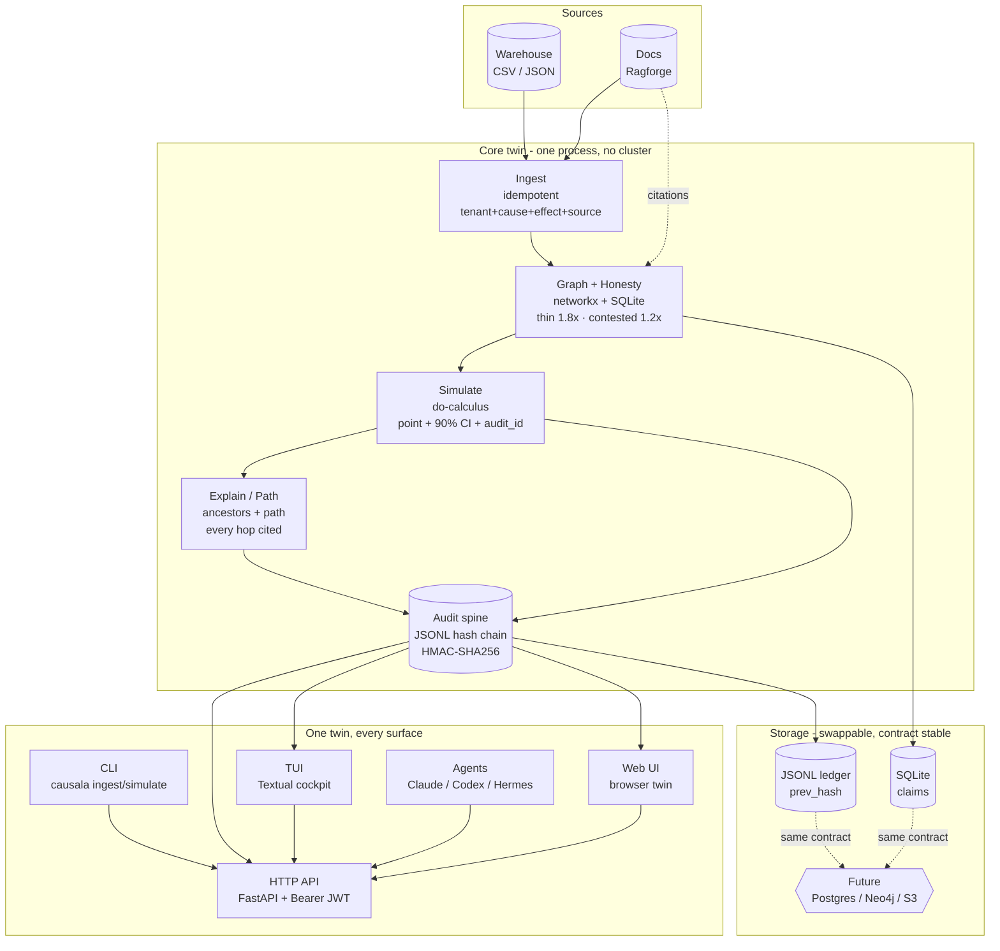

<p align="center">
  
</p>

<h1 align="center">CAUSALA - The decision twin that proves what your next lever will cause</h1>

<p align="center">
  What your board asks before you spend. CAUSALA answers with a point, a 90% band, and a signed receipt.<br/>
  <em>Warehouse CSV when you have it. No warehouse to try.</em>
</p>

<p align="center">

[](https://github.com/harshaaaaw/Causala)
[](LICENSE)
[](https://github.com/harshaaaaw/Causala/actions)
[](causala/pyproject.toml)

</p>

<p align="center">

[Quickstart](#quickstart) · [Python API](causala/README.md) · [Architecture](#architecture) · [Roadmap](ROADMAP.md) · [Security](SECURITY.md)

</p>

<p align="center">
  
</p>

<p align="center">
  
</p>

```bash
git clone https://github.com/harshaaaaw/Causala.git && pip install -e ./causala -e ./ragforge && causala quickstart
```

```
demand:  2.46%  [1.985, 2.935]  audit cd98f5cc  finance-q3-review  price -> demand
margin:  1.75%  [1.174, 2.332]  audit 03ef0410  finance-q3-review  price -> demand -> margin
```

Copy, paste, see a lever become a cited number with a band and a receipt. Or `causala serve` and do it in your browser — same twin, no build.

## Why this twin exists

Most teams have a warehouse that shows what happened, an LLM that guesses why, and a spreadsheet that invents ROI. None can answer what happens if we do X with a number you can defend. BCG put it plainly in 2026. Three quarters of leaders rank AI top three, one in four sees returns, six in ten set no KPI. Forrester found 88 percent of pilots never ship. The gap is not better models. It is the receipt.

Built for the CFO who prices a lever, the product lead who tests before code, and the compliance lead who must replay why three quarters later.

## One twin, four moves

CAUSALA is one twin where every lever you pull returns a point, a 90 percent band, and a signed audit. Same graph, same ledger, same tenant. Not five tools that disagree.

| Move | What you do | What you get |
|---|---|---|
| Graph | `causala ingest --cause price --effect demand --conf 0.82 --source finance-q3-review` or `causala ingest-csv --file examples/warehouse.csv` | Versioned claims per tenant, idempotent on `tenant + cause + effect + source`, retractable |
| Honesty | The engine widens the band when data is thin or the path is contested | The band before the point, so you never see false precision |
| Simulate | `causala simulate --lever price --delta 3` | Every downstream outcome with `point [ci_low, ci_high] audit_id honest_note` |
| Receipt | `causala audit --id cd98f5cc` or `causala verify-chain` | Hash-chained JSONL with `prev_hash` and HMAC-SHA256 per tenant |

## Quickstart

Three steps. Under sixty seconds. No auth wall.

```bash
git clone https://github.com/harshaaaaw/Causala.git && cd Causala
pip install -e ./causala -e ./ragforge
causala quickstart
# -> demand: 2.46% [1.985, 2.935] audit cd98f5cc
# -> margin: 1.75% [1.174, 2.332] audit 03ef0410
```

Your own graph:

```bash
causala ingest --cause price --effect demand --conf 0.82 --source finance-q3-review --tenant acme
causala simulate --lever price --delta 3 --tenant acme
causala tui
```

Python, same twin:

```python
from causa import Causala
twin = Causala("twin.db")
twin.ingest_claim("price", "demand", 0.82, "finance-q3-review", "acme")
twin.ingest_claim("demand", "margin", 0.75, "finance-q3-review", "acme")
for r in twin.simulate("price", 3, "acme"):
    print(r.outcome, r.point, [r.ci_low, r.ci_high], r.audit_id, r.honest_note)
```

Any agent writes to the same ledger:

```bash
causala agent claude "price +3% should we do it?"   # claude --print
causala agent codex "headcount +5?"                  # codex exec
causala agent generic --cmd "my-agent --flag" "task"
```

`causala tui` is a Textual cockpit. No browser. Keys `1` dashboard `2` graph `3` simulate `4` audit `5` agents `6` skills `c` simulate `q` quit.

`causala serve` is the same twin in your browser. No build, no Node.

```bash
pip install -e ./causala -e ./ragforge
causala serve  # -> http://127.0.0.1:8000  (also at /web)
# open the URL, ingest a claim left, simulate center, copy the receipt right
```

Works offline with mock data if no server. Same SQLite ledger as CLI and TUI.

[Full CLI and Python docs](causala/README.md)

## Architecture

How to read it in 20 seconds: your warehouse CSV and docs go in the left, the twin validates and widens the band in the middle, every simulate writes a receipt on the right. One process. Same API whether you use CLI, TUI, or the browser.



Premium dark diagram with full tenant and rate-limit detail: [`docs/architecture.html`](docs/architecture.html) — open in any browser, no dependencies. Also available as SVG for slides.

One process on your laptop. No cluster. The twin recomputes downstream through your causal graph. I kept it to one file you can copy before you ask infra for Postgres or Neo4j. Principles:

* Cited. No answer without a source.
* Banded. If data is thin, the band shows it.
* Receipted. Every run has a hash-chained audit.
* Isolated. One tenant is one graph.

Swap SQLite for Postgres, JSONL for S3, networkx for Neo4j later. The contract `simulate -> point + CI + audit_id` does not change. See `causala/src/causa/ingest.py` `_fit_group`.

## How it compares

| What you need | Spreadsheets | Dashboards | CAUSALA |
|---|---|---|---|
| Citation per cause | no | no | yes, source per claim |
| 90% band with honesty | no | no | yes, widened on thin data |
| Path every hop cited | no | no | yes |
| Signed audit | no | no | yes, hash chain |

Spreadsheets show a point with no band, dashboards show correlation with no cause, CAUSALA shows a point with a band and a receipt you can hand to finance.

## Honest limits

* Spec imagines DoWhy, EconML, PyMC, Neo4j, Kafka and S3. This build runs in-process with networkx and SQLite and a JSONL ledger so you can run with zero infra. The backend is swappable.
* Effect size today uses confidence as proxy plus CI from variance and small-data widening. Next build fits a posterior per edge. The API does not change.
* Ingestion today is CSV and JSON from Snowflake or BigQuery. Airflow and Spark are on the roadmap.

## Contributing

1. Fork, branch `feature/your-feature`
2. `pip install -e ./causala -e ./ragforge && pytest -q && ruff check causala/src ragforge --config causala/pyproject.toml`
3. PR with test evidence

We triage every PR and issue within 48 hours. See [CONTRIBUTING.md](CONTRIBUTING.md).

## Security

See [SECURITY.md](SECURITY.md). Do not open public issues for vulnerabilities.

## License

MIT (c) [Deva Harsha Mummareddy](https://github.com/harshaaaaw) - see [LICENSE](LICENSE)
