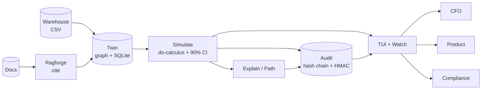

<p align="center">
  
</p>

<h1 align="center">What will this lever actually cause?</h1>

<p align="center">
  <strong>Your board asks before you spend. CAUSALA answers with a point, a 90% band, and a signed receipt.</strong><br/>
  No more correlation as causation. No more point estimate with no band.
</p>

<p align="center">

[](https://github.com/harshaaaaw/Causala)
[](LICENSE)
[](https://github.com/harshaaaaw/Causala/actions)
[](causala/pyproject.toml)
[](https://github.com/harshaaaaw/Causala/releases)

</p>

<p align="center">

[Get started in 60 seconds](#quickstart) · [Python API](causala/README.md) · [Architecture](#architecture) · [Roadmap](ROADMAP.md) · [Security](SECURITY.md)

</p>

<p align="center">
  demand then simulate price +3% -> point + 90% CI + audit" width="880"/>
  <br/>
  <em>Local twin, no warehouse needed. Warehouse CSV when you have it.</em>
</p>

```
$ causala simulate --lever price --delta 3 --tenant acme

  demand:  2.46%  [1.985, 2.935]  audit cd98f5cc
    cite: finance-q3-review  path: price -> demand  conf 0.82
    honest: thin data (n=4) -> wide CI width 0.95
  margin:  1.75%  [1.174, 2.332]  audit 03ef0410
    cite: finance-q3-review  path: price -> demand -> margin  conf 0.58
    honest: thin data (n=4) -> wide CI width 1.16
```

That is the whole product: you move a lever, the twin recomputes downstream through your causal graph, every number has a band, every run has a receipt you can hand to finance or a regulator.

## Why this twin exists

Most teams have three things that do not talk to each other: a warehouse that shows what happened, an LLM that guesses why, and a spreadsheet that invents ROI. None of them can answer *what will happen if we do X* with a defensible number. Marketing builds one model, finance builds another, ops builds a third, and the board gets a point estimate with no band and no source.

BCG 2026 put it plainly: 75% of leaders rank AI top-3 priority, 1 in 4 sees meaningful returns, 60% set no financial KPIs. Forrester: 88% of pilots never reach production. The gap is not better models. It is the receipt — a per-company twin that is honest about uncertainty and auditable months later.

CAUSALA is that receipt. Your causal graph lives here, your warehouse export fits here, every what-if is recomputed through the graph, every run writes a hash-chained signed audit. Same graph, same ledger, same tenant isolation. Not five tools that disagree.

We built it to run on your laptop first. No Neo4j, no Kafka to try. `examples/warehouse.csv` is enough. When you need Snowflake or BigQuery, the ingestor is a single function to replace.

## Who reaches for it

|  |  |
|---|---|
| **CFO** prices a headcount or price change from a signed ledger, not a narrative | **Product** tests a lever before code, with the causal path that explains why |
| **Ops** traces cost_up back to cache_miss with citations, not hunches | **Compliance** replays why the model said X three quarters later |

## How the twin works — four moves

1. **Graph your causes.** `causala ingest --cause price --effect demand --conf 0.82 --source finance-q3-review` or `causala ingest-csv --file examples/warehouse.csv`. Idempotent by `(tenant, cause, effect, source)`, retractable, tenant scoped.

2. **Honesty before math.** The engine widens the 90% band when data is thin (`n<5` -> 1.8x), when the path is contested, or when confidence is low. No false precision. You see the band before you see the point.

3. **Simulate the lever.** `causala simulate --lever price --delta 3` does do-calculus over the graph version you ingested. Every reachable downstream outcome returns `point + [ci_low, ci_high]` plus `audit_id`.

4. **Hand the receipt.** Every outcome writes a hash-chained `prev_hash + HMAC-SHA256` record scoped to your tenant. `causala audit --id cd98f5cc` or `causala verify-chain` is the audit, not a PDF you build after.

## Quickstart — 60 seconds, no warehouse

```bash
git clone https://github.com/harshaaaaw/Causala.git && cd Causala
pip install -e ./causala -e ./ragforge
causala quickstart                 # ingests examples/warehouse.csv + simulates price +3%
# -> demand: 2.46% [1.985, 2.935] audit cd98f5cc
# -> margin: 1.75% [1.174, 2.332] audit 03ef0410

# your own graph
causala ingest --cause price --effect demand --conf 0.82 --source finance-q3-review --tenant acme
causala ingest-csv --file examples/warehouse.csv --tenant acme
causala simulate --lever price --delta 3 --tenant acme
causala tui                         # cockpit: graph, simulate, audit live
```

Python, same twin:

```python
from causa import Causala
twin = Causala("twin.db")
twin.ingest_claim("price", "demand", 0.82, "finance-q3-review", "acme")
twin.ingest_claim("demand", "margin", 0.75, "finance-q3-review", "acme")
for r in twin.simulate("price", 3, "acme"):
    print(r.outcome, r.point, [r.ci_low, r.ci_high], r.audit_id, r.honest_note)
    # demand 2.46 [1.985, 2.935] cd98f5cc thin data (n=2) -> wide CI
    print(twin.get_audit(r.audit_id))  # signed receipt
```

[Full CLI and python docs ->](causala/README.md)

## Honesty engine

The engine never hides uncertainty to look confident.

* **Thin data:** fewer than 5 claims for the tenant -> band 1.8x
* **Contested path:** any edge `confidence < 0.5` -> `contested=true`, band 1.2x
* **Long chain:** product of confidences lowers path confidence, widens band
* Every result carries `honest_note`: `thin data (n=4) -> wide CI width 0.95 - verify with upstream warehouse export`

A point without a band is a story. CAUSALA refuses to tell stories.

## Cockpit — terminal, not browser

`causala tui` is a Textual dashboard that feels like Claude Code. No browser.

* **Dashboard** recent simulates with point, CI, audit at a glance
* **Graph** live causal chain `price -> demand -> margin` and tenant claim count
* **Simulate** run lever + delta% and inspect CI plus honest note
* **Audit** hash-chained ledger with `prev_hash` and signature, tenant scoped
* **Agents** connected agents and their last simulate
* **Skills** installed skills, required starred, grounded check

Keys: `1` dashboard `2` graph `3` simulate `4` audit `5` agents `6` skills `c` simulate `q` quit.
Headless: `causala watch` tails the same flow in plain logs.

## Any lever, any agent

Every agent writes to the same signed ledger. Use its own command or any CLI.

| Agent | Try |
|---|---|
| Claude Code | `causala agent claude "price +3% should we do it?"` -> `claude --print` |
| Codex | `causala agent codex "headcount +5?"` -> `codex exec` |
| Hermes | `causala agent hermes "cache_miss impact?"` -> `hermes agent` |
| OpenClaw | `causala agent openclaw "margin risk?"` -> `openclaw run` |
| Any CLI | `causala agent generic --cmd "my-agent --flag" "task"` |

Each run parses the lever, simulates via the graph, signs an audit, and streams to `causala tui`. If the CLI is not installed, a grounded mock still produces a verifiable simulation so you can try without setup.

## Architecture — a twin, not a platform

AEGIS needs ten subsystems to govern agents. CAUSALA needs four moves to defend a decision. Different problems, different shapes.



One process on your laptop. No cluster to try. When you need Postgres, Neo4j, or Kafka/S3, the graph and audit backends are behind `Causala(db_path, audit_secret)` and swappable — the contract (`simulate -> point + CI + audit_id`) does not change.

## Skills — grounded to the decision

```bash
causala skill list                       # required starred
causala skill install causala-sim        # from hub
causala skill add ./my-skill             # local SKILL.md
causala skill verify causala-audit       # grounded check
```

Required skills always enabled: `causala-simulate`, `causala-audit`, `causala-ingest`, `causala-explain`. Each has `SKILL.md` with objective. The TUI shows only grounded skills.

## How CAUSALA compares

| Capability | Dashboards | LLM + RAG | Spreadsheets | CAUSALA |
|---|---|---|---|---|
| Citation per cause | no | sometimes | no | yes (source per claim) |
| Point + 90% CI with honesty | no | no | no | yes (widened on thin data) |
| Causal path every hop cited | no | no | no | yes (path + ancestors) |
| Conflict surfacing | no | no | no | yes |
| Signed hash-chained audit | no | no | no | yes (per simulate) |
| Tenant isolation + idempotent ingest | no | no | no | yes |
| TUI cockpit | no | no | no | yes |
| Any-agent to same ledger | no | one | no | claude, codex, hermes, openclaw, generic |

Spreadsheets give you a point. Dashboards give you correlation. LLMs give you a paragraph. CAUSALA gives you a receipt.

## Honest limits

* Spec imagines DoWhy/EconML/PyMC, Neo4j, Kafka/S3. This build runs in-proc with networkx over SQLite and a JSONL hash-chained ledger so you can run with zero infra. Backend is swappable, contract is real, `_fit_group` in `ingest.py` is the seam where a Bayesian fitter lands without changing `simulate`.
* Effect size today uses confidence as magnitude proxy plus CI from variance and small-data widening. The next build fits a posterior per edge — the simulate API does not change.
* Ingestion today is CSV/JSON exports from Snowflake/BigQuery. Airflow/Spark connectors are roadmap.

## Contributing

1. Fork, branch `feature/your-feature`
2. `pip install -e ./causala -e ./ragforge && pytest -q && ruff check causala/src ragforge --config causala/pyproject.toml`
3. PR with test evidence

We triage every PR and issue within 48 hours. See [CONTRIBUTING.md](CONTRIBUTING.md).

## Security

See [SECURITY.md](SECURITY.md) for trust boundaries and reporting. Do not open public issues for vulnerabilities.

## License

MIT (c) [Deva Harsha Mummareddy](https://github.com/harshaaaaw) — see [LICENSE](LICENSE)

---

<p align="center"><em>If CAUSALA helped you defend a decision, leave a star. It helps others find the twin.</em></p>
