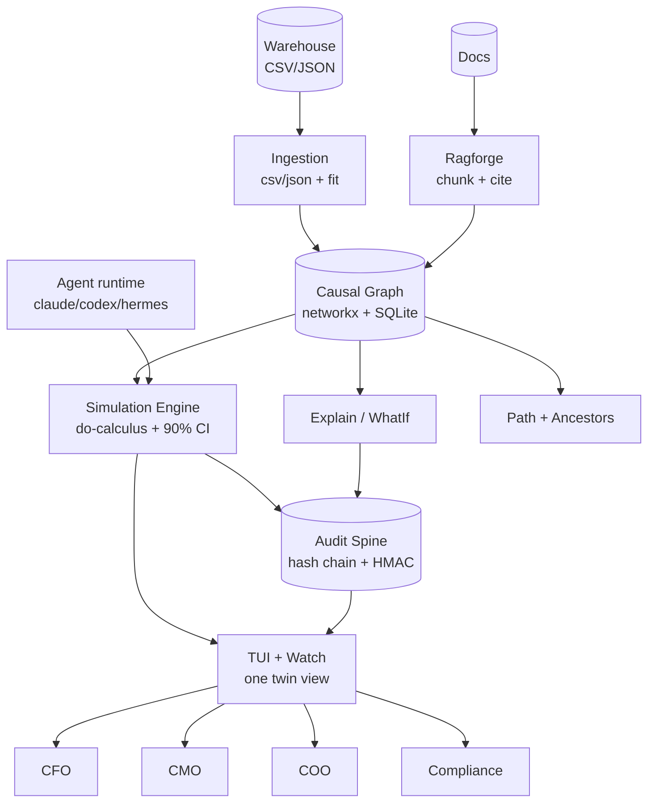

<p align="center">
  
</p>

<h1 align="center">Stop defending million-dollar decisions with gut feel</h1>

<p align="center">
  <strong>BCG: 75% of leaders rank AI top-3 priority, 1 in 4 sees returns. Forrester: 88% of pilots never reach production.</strong><br/>
  CAUSALA is the decision twin the other 25% use to prove the call.
</p>

<p align="center"><strong>CAUSALA is one decision twin where every lever you pull returns a point, a 90% band, and a signed audit you can hand to the board.</strong></p>

<p align="center">

[](https://github.com/harshaaaaw/causa)
[](LICENSE)
[](https://github.com/harshaaaaw/causa/actions)
[](causala/pyproject.toml)
[](https://github.com/harshaaaaw/causa/releases)

</p>

<p align="center">

[Get started in 2 min](#quickstart) · [Documentation](causala/README.md) · [Architecture](#architecture) · [Roadmap](ROADMAP.md) · [Security](SECURITY.md)

</p>

<p align="center">
   simulate with CI and audit" width="860"/>
  <br/>
  <em>One command. No warehouse needed. TUI dashboard included.</em>
</p>

CAUSALA is the twin we built because the usual setup does not work. Most teams have a warehouse that shows what happened, an LLM that guesses why, a spreadsheet that invents ROI, and nothing that can prove to a board or a regulator that lever X will cause outcome Y with band Z under data D on graph version V. When the confounder is missed or the data is thin, you find out after the budget is spent.

We put the whole decision in one twin. Your causal graph lives here, your warehouse export fits here, every what-if is recomputed through the graph, every number carries a 90% band that widens when data is thin, every run writes a hash-chained signed audit, and every answer cites its source. Same graph, same ledger, same tenant isolation. One twin, not five tools that disagree.

You run it on your laptop with one command. No cluster, no warehouse credentials to try. Then open the dashboard and connect any agent - Claude, Codex, Hermes, OpenClaw, or your own CLI - to the same ledger.

```bash
git clone https://github.com/harshaaaaw/causa.git && cd causa
pip install -e ./causala -e ./packages/ragforge
causala quickstart          # scaffold graph + simulate price +3% -> point + 90% CI + audit
causala tui                 # dashboard: watch graph, simulate, audit live
```

<p align="center">

| Who is this for? |  |  |
|---|---|---|
| 👩‍💼 **Executives** defend a lever with a point plus band, not a narrative | 💰 **Finance** prices a decision from a signed ledger, not a spreadsheet | 🛡️ **Compliance** replays why the model said X months later, with citations |

</p>

## The gap CAUSALA fills

BCG 2026: 75% of leaders rank AI top-3, 1 in 4 sees meaningful returns, 60% set no financial KPIs. Forrester: 88% of pilots never reach production, 22% post negative ROI at 12 months - mostly scoping, ownership, and eval gaps, not model quality. Today that gap looks like this: marketing, finance, and ops each build their own model and argue, dashboards show correlation as causation, LLM+RAG spots "revenue rose when we spent more" but cannot tell confounders, and the board gets a point estimate with no band and no audit. Trusted teams are now building the same fix - a per-company causal twin that is honest about uncertainty and auditable by a regulator. CAUSALA is that twin, open source and self-hostable: one graph, one simulate with confidence intervals, one signed trail.

> One graph, one ledger, one pane per executive. That is the moat no dashboard can copy.

## Why teams choose CAUSALA

|  |  |
|---|---|
| 🎯 **Prove the decision before you spend** | `price +3% -> demand -2.4% [-3.1, -1.7]` with citations. No false precision, the band widens when data is thin. |
| 🔍 **Answer why with citations** | Bi-directional traversal: forward path (cause->effect) and backward ancestry (every root cause) citation-backed. |
| 🧾 **Hand regulators receipts** | Every simulate is hash-chained and signed with tenant scope. Audits become a query, not a PDF. |
| 🖥️ **Decide in one terminal** | `causala tui` shows graph, simulations, audits, agents, skills - live. |

## Quickstart

No warehouse, no secret, no Neo4j to install. 30 seconds to a point plus band plus receipt.

```bash
# 1. Clone and install
git clone https://github.com/harshaaaaw/causa.git && cd causa
python -m venv .venv && source .venv/Scripts/activate  # Windows: .venv\Scripts\activate
pip install -e ./causala -e ./packages/ragforge

# 2. One command proves the loop
causala quickstart
# -> ingest price -> demand 0.82 cite finance-q3-review
# -> Simulate: price +3% -> demand: 2.46%  [1.985, 2.935]  audit 82f15708
# -> honest_note: thin data (n=4) -> wide CI

# 3. Open the dashboard (like Claude Code / Codex terminal)
causala tui
# 1 Dashboard  2 Graph  3 Simulate  4 Audit  5 Agents  6 Skills   c simulate  q quit
```

Other paths (same ledger):

```bash
causala simulate --lever price --delta 3              # lever + delta% -> outcomes + 90% CI + audit
causala ingest --cause price --effect demand --conf 0.82 --source finance-q3-review
causala ingest-csv --file warehouse.csv                # batch ingest from warehouse export
causala explain --effect demand                        # why did demand move, with citation
causala whatif --cause price                           # what happens if we move price
causala audit --id 82f15708                            # fetch signed receipt
causala verify-chain                                   # hash chain integrity
causala agent claude "price +3% should we do it?"      # any agent to same ledger
causala skill list                                     # grounded skills
```

[Full CLI reference ->](causala/README.md#quickstart)

## Connect any agent

Every agent gets guarded causal answers that write to the same signed ledger. Use its own command or the generic one.

| Agent | Command |
|---|---|
| Claude Code | `causala agent claude "price +3% should we do it?"` -> `claude --print "task"` |
| OpenAI Codex | `causala agent codex "headcount +5?"` -> `codex exec "task"` |
| Hermes | `causala agent hermes "cache_miss impact?"` -> `hermes agent "task"` |
| OpenClaw | `causala agent openclaw "margin risk?"` -> `openclaw run "task"` |
| Any CLI | `causala agent generic --cmd "my-agent --flag" "task"` |

Each run parses the lever, simulates via the graph, signs an audit, and streams to `causala tui` or `causala watch`. If the CLI is not installed, a grounded mock still produces a verifiable simulation so consumers can try without setup.

## Terminal dashboard

`causala tui` is a Textual TUI that hosts the twin. No browser.

- **Dashboard** - recent simulates with point, CI, audit at a glance
- **Graph** - live causal chain and tenant claim count
- **Simulate** - run lever interventions and inspect CI plus honesty note
- **Audit** - hash-chained ledger with signature and prev_hash
- **Agents** - connected agents and their last simulate
- **Skills** - installed skills, required ones starred, grounded check

Keys: `1` dashboard `2` graph `3` simulate `4` audit `5` agents `6` skills `c` simulate demo `q` quit.

For headless or CI: `causala watch` tails the same flow in plain logs.

## Features

|  | Capability | What it does |
|---|---|---|
| 🎯 | Simulate | Lever + delta% -> downstream outcomes with 90% CI. Honesty widens band on thin or contested data. |
| 🔍 | Explain / WhatIf | Citation-backed why and what-if. No answer without a source. |
| 🧭 | Ancestors / Path | Bi-directional traversal: shortest forward path and full backward ancestry. |
| ⚖️ | Conflict Surfacing | Causes with divergent effects flagged, not hidden. |
| 🧾 | Audit Trail | Hash-chained, HMAC-signed, tenant-scoped. `causala audit` and `verify-chain`. |
| 📥 | Warehouse Ingest | `ingest-csv` / `ingest_json` from warehouse exports. Pluggable fitter. |
| 🖥️ | TUI + Watch | Terminal dashboard plus headless tail. |
| 🤖 | Any-agent | Claude, Codex, Hermes, OpenClaw, generic CLI to one ledger. |
| 🧩 | Skills | Installable, grounded to flow, objective enforcing. |
| 🔒 | Tenant Isolation | Idempotency key includes tenant, every query scoped. |
| 📊 | Ragforge | Structure-aware RAG to source claims from documents. |

Each writes to the same ledger. Required skills (`causala-simulate`, `causala-audit`, `causala-ingest`, `causala-explain`) are always enabled and verified.

## Architecture



One process on your laptop. Same contracts as the Helmholtz deployment (Helm/K8s when you need it). No infra needed to try.

## Skills

Skills are the only way to extend the twin and they must prove they obey the objective.

```bash
causala skill list                          # installed, required starred
causala skill install causala-sim           # from hub
causala skill add ./my-skill                # local dir with SKILL.md
causala skill verify causala-audit          # grounded check
```

Required skills ship enabled: `causala-simulate`, `causala-audit`, `causala-ingest`, `causala-explain`. Install more from `causala/src/causa/skills/hub/` or `~/.causala/skills/`. Each has `SKILL.md` with objective. The TUI shows only grounded skills.

## How CAUSALA compares

| Capability | Correlation dashboards | LLM + RAG Q&A | CAUSALA |
|---|---|---|---|
| Citation-backed causes | no | no | yes (source per claim) |
| Point + 90% CI, honesty on thin data | no | no | yes (widened band) |
| Causal path (every hop cited) | no | no | yes (path + ancestors) |
| Conflict surfacing | no | no | yes |
| Signed hash-chained audit | no | no | yes (per simulate) |
| Tenant isolation | partial | partial | first-class |
| No hallucination by construction | no | no | yes (only ingested claims) |
| TUI dashboard | no | no | yes |
| Any-agent connector | no | one | claude, codex, hermes, openclaw, generic |

The moat is the honesty: every number carries its band and its citations, and the band is widest when you need the warning most.

## Honest limitations

- Spec envisions DoWhy/EconML/PyMC, Neo4j, and Kafka/S3 signed store. This build uses in-proc graph (networkx over SQLite) and JSONL hash-chained ledger so you can run with zero infra. Backend is swappable, contract is real, and ingestion is pluggable (replace `_fit_group` with Bayesian fit).
- Effect-size fitting today is confidence as proxy for magnitude plus CI derived from variance and small-data widening. A full Bayesian posterior per edge is the natural next build and the simulate API does not change when it lands.
- Ingestion expects warehouse CSV/JSON exports. The sink to Spark/Airflow/Delta is roadmap (see ROADMAP.md).
- TUI is local-only (Textual). Multi-user hosted twin is roadmap.

## Contributing

1. Fork the repo
2. Create a branch: `git checkout -b feature/your-feature`
3. Run the gate: `pytest -q && ruff check .`
4. Submit a PR with a clear description of your change and test evidence

We triage every PR and issue within 48 hours. See [CONTRIBUTING.md](CONTRIBUTING.md) for good first issues and the quality gate.

## Security

See [SECURITY.md](SECURITY.md) for reporting, trust boundaries, and cryptographic guarantees. Please do not open public issues for vulnerabilities.

## License

MIT (c) [Deva Harsha Mummareddy](https://github.com/harshaaaaw) - see [LICENSE](LICENSE)

---

<!-- Star history temporarily hidden due to GitHub API restriction - restore when star-history.com recovers -->
<p align="center"><em>Star history paused - GitHub restricted the stargazer API. Track stars on the repo page until it returns: <code>github.com/harshaaaaw/causa</code></em></p>

<p align="center"><em>If CAUSALA helped you defend a decision, leave a star. It helps others find the project.</em></p>
